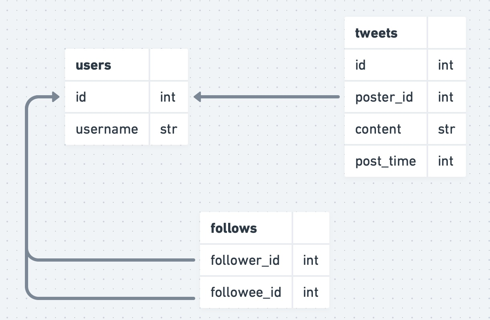

# Entities/Nouns/Data Model

We’re going to start creating tables in SQLite for this lab, run this to start an in-memory instance of sqlite (note that any work will be lost if you restart sqlite).

```
sqlite3
```{{exec}}

First, let’s think about what tables we should create. Try to come up with a data model on your own to support the use case described above and then write the create table statements for it. You're welcome to create your table in the sqlite instance and insert some mock data in them. Once you’re ready, compare your solution with the one below. You can either keep your data model as you put it into the system and adapt the rest of the lab to work for your own data model or you can use the code I provide below which will work with the rest of the lab code. In general, feel free to follow this same rule of thumb for all labs.

<details><summary><b>Solution (click to expand)</b></summary>
The key entities/nouns here are:

Users

Tweets

Follows



[Diagram Link](https://whimsical.com/lab-0-1-entities-data-model-GVgogWwQiMcsU5roiByNjK)

Let’s create the tables for our users, tweets, and follows in our SQLite database.

```
create table users (
    id integer primary key,
    username text unique
);

create table tweets (
    id integer primary key,
    poster_id integer references users(id),
    content text,
    post_time integer
);

create table follows (
    follower_id integer references users(id),
    followee_id integer references users(id)
);
select 'done';
```{{exec}}

</details>

Note that SQLite [does not enforce foreign keys by default](https://www.sqlite.org/foreignkeys.html), we could turn on foreign key enforcement but that would slightly complicate some of the code in this lab, so we’re not going to do so.
    
Let’s turn on headers at this time to make the query results easier to understand:

```
.headers on
```{{exec}}

Ok, we’re ready to start implementing the timeline feature.
